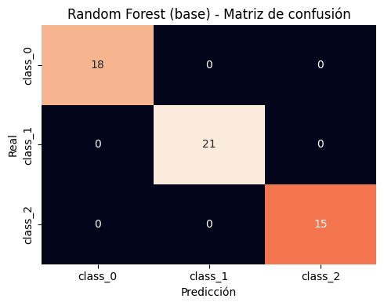
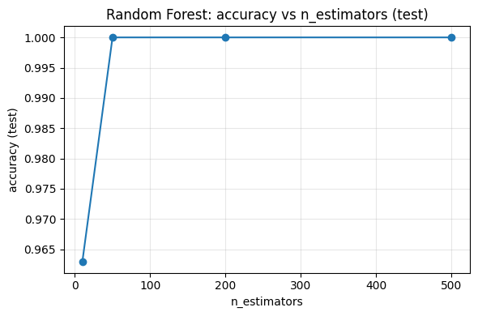
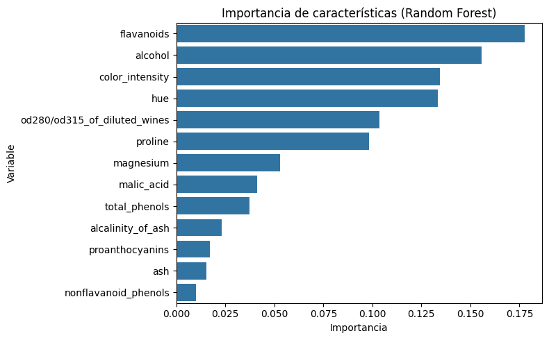

# 🌳 Comparación de Árboles de Decisión y Random Forest en la Clasificación del Dataset Wine

**Autora:** Christell Lissette García Sagastume  
**Universidad del Valle de Guatemala**

---

## 📑 Resumen
Este artículo presenta la comparación entre modelos de Árbol de Decisión y Random Forest aplicados al *Wine Dataset* disponible en `scikit-learn`.  
Se evaluaron hiperparámetros clave como la profundidad máxima, el tamaño mínimo de división y el número de estimadores.  

Los resultados muestran que el Random Forest ofrece mayor robustez y estabilidad frente al sobreajuste, logrando un desempeño perfecto en el conjunto de prueba, mientras que los árboles individuales tienden a sobreajustar. Además, se analizó la importancia de las variables, destacando el rol de los flavonoides y el grado alcohólico en la clasificación de los vinos.

---

## 🔎 Introducción
Los algoritmos basados en árboles son ampliamente utilizados en aprendizaje automático supervisado debido a su interpretabilidad y simplicidad.  
Sin embargo, los Árboles de Decisión pueden sufrir de sobreajuste. Los métodos de ensamble, como los Random Forest, reducen esta limitación al combinar múltiples árboles, mejorando la capacidad de generalización.

Este estudio compara ambos enfoques aplicados al problema de clasificación multiclase del *Wine Dataset* (178 observaciones, 13 atributos químicos).

---

## ⚙️ Metodología
1. **Preparación de datos:**  
   - Dataset cargado desde `scikit-learn` con `as_frame=True`.  
   - Separación en entrenamiento (70%) y prueba (30%), con estratificación.  

2. **Modelos entrenados:**  
   - Árbol de Decisión básico (hiperparámetros por defecto).  
   - Árbol de Decisión ajustado (`max_depth=3`, `min_samples_split=10`).  
   - Random Forest básico (hiperparámetros por defecto).  
   - Random Forest variando `n_estimators` (10, 50, 200, 500).  

3. **Métricas de evaluación:**  
   - Accuracy  
   - Matrices de confusión  
   - Reportes de clasificación  
   - Importancia de características  

---

## 📊 Resultados

- **Árbol de Decisión básico:** `Acc_train=1.00`, `Acc_test=0.963` → sobreajuste leve.  
- **Árbol ajustado:** `Acc_train=0.992`, `Acc_test=0.963` → ligera mejora en generalización.  
- **Random Forest básico:** `Acc_train=1.00`, `Acc_test=1.00` → mayor estabilidad.  
- **Random Forest con múltiples estimadores:** el desempeño se estabilizó a partir de 50 árboles.  
- **Importancia de variables:** flavonoides, alcohol e intensidad de color fueron las más relevantes.  

### Figuras

#### Árbol de Decisión básico

#### Árbol de Decisión ajustado

#### Random Forest básico

#### Sweep de n_estimators

#### Importancia de características

---

## 💬 Discusión
- Los Árboles de Decisión, aunque interpretables, son propensos al sobreajuste.  
- Limitar la complejidad con hiperparámetros mejora la generalización.  
- Random Forest supera en desempeño y estabilidad al reducir la varianza mediante ensamble.  
- Las variables más relevantes (flavonoides, alcohol) coinciden con factores enológicos reales.

---

## ✅ Conclusiones
- Random Forest superó consistentemente al Árbol de Decisión, logrando desempeño perfecto en prueba.  
- Los hiperparámetros más influyentes fueron `max_depth`, `min_samples_split` y `n_estimators`.  
- El análisis de importancia de características fue coherente con el dominio, validando la utilidad del modelo.  

---

## 📌 Recomendaciones
- Usar Random Forest como modelo base en problemas de clasificación multiclase.  
- Limitar la profundidad de árboles cuando se priorice interpretabilidad y rapidez.  
- Optimizar hiperparámetros con Grid Search para mejorar robustez.  
- Replicar el análisis en datasets de ingeniería civil e infraestructura (ej. Smart Cities).  

---

## 📚 Referencias
- Pedregosa, F. et al. (2011). *Scikit-learn: Machine Learning in Python*. Journal of Machine Learning Research, 12, 2825-2830.  
- Aeberhard, S., Forina, M. (1991). *Wine Recognition Data*. UCI Machine Learning Repository. Disponible en: [https://archive.ics.uci.edu/ml/datasets/wine](https://archive.ics.uci.edu/ml/datasets/wine)  
